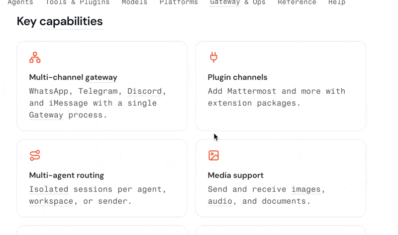

# 轻译 Float — 英文词汇标注 Chrome 扩展

自动将你词库里的单词在网页上**高亮标注**；鼠标悬停查看 AI 生成的中文释义；右键或通过悬浮球随时把新词**一键添加**到词库——添完立刻关闭弹窗，后台自动刷新当前页面的标注。

## 演示：如何查看标记效果（GIF）

下面这个 GIF 展示了**通过 AI 自动标记网页英文单词（高亮）**的实际效果：



如果预览没有自动播放，可以直接点击查看原图：
- [`assets/marked-demo.gif`](assets/marked-demo.gif)
- [`assets/CleanShot 2026-04-04 at 15.20.44.gif`](<assets/CleanShot 2026-04-04 at 15.20.44.gif>)


---

## 核心功能

### 自动标注 & 悬停释义
- 页面加载后自动扫描文本，将词库内的单词高亮显示
- 鼠标悬停弹出释义气泡，释义由 AI 根据领域上下文生成
- 支持键盘快捷键一键开关当前页面标注

### 自定义词库
- 可创建多个词库（如：前端 / 后端 / 医学 / 法律）
- 按领域分类管理单词，添加时可选择领域（技术、医学、法律、金融、学术、文学或自定义）
- 支持一键导入 / 导出词库文件，方便迁移和分享

### AI 生成释义并添加
- 右键选中单词 → "添加到词库"，或点击页面右侧悬浮球
- 选好词库和领域后点击「AI 生成释义并添加」：弹窗**立即关闭**，后台完成生成与写入，当前页面标注**自动刷新**
- 支持 fallback：API 不可用时先用本地释义写入，后台排队等待补全

### 性能
- 词库统一加载到后台 Service Worker，所有标签页**共享同一套词库**，单标签页可节省 20MB+ 内存

### GitHub Gist 云同步
- 词库变更 10 秒防抖后自动上传到指定私有 Gist
- 支持手动「立即上传」/「下载并覆盖本地」
- 含时间戳冲突保护，下载时若本地数据更新则拒绝覆盖


---

## 安装

> 支持 Chrome、Edge 及其他兼容 Chrome Extension 的浏览器。

```bash
git clone <仓库地址>
```

**Chrome**
1. 打开 `chrome://extensions/`
2. 右上角开启「开发者模式」
3. 点击「加载已解压的扩展程序」，选择项目根目录

**Edge**
1. 打开 `edge://extensions/`
2. 左下角开启「开发人员模式」
3. 点击「加载解压缩的扩展」，选择项目根目录

---

## 云同步配置（可选）

1. 打开扩展的**词库管理页面**（点击扩展图标 → 设置，或右键图标 → 选项）
2. 找到「云同步（GitHub Gist）」区块
3. 勾选「启用词库云同步」，填入：
   - `GitHub Token`（需要 `gist` 读写权限）
   - `Gist ID`（留空则首次上传时自动创建私有 Gist）
4. 保存后，点「立即上传」推送词库；在其他设备填入相同 Token + Gist ID 后点「立即下载并覆盖本地」即可同步

**安全说明**：Token 和 Gist ID 存储在 `chrome.storage.sync`；云端 Gist 为私有，不公开可见。

---

## 项目结构

```
├── manifest.json              # 扩展配置（Manifest V3）
├── src/
│   ├── background.js          # 后台 Service Worker：词库管理、AI 调用、消息路由
│   ├── content.js             # 注入页面：文本扫描、单词标注、释义气泡
│   ├── floating-ball.js       # 页面悬浮球：快速添加新词入口
│   ├── add-word.html/js       # 添加单词弹窗
│   ├── popup.html/js          # 工具栏弹出层
│   ├── options.html/js/css    # 词库管理页
│   ├── vocab-lib.js           # 词库 CRUD 逻辑
│   ├── vocab-worker.js        # 词库数据处理
│   ├── word-data.js           # 单词数据结构
│   ├── gist-service.js        # GitHub Gist 同步
│   └── icons/
├── mcp-server/                # 本地 MCP Server（可选，供 AI IDE 调用词库）
├── assets/                    # README 截图
└── tests/                     # 测试与 fixtures
```
